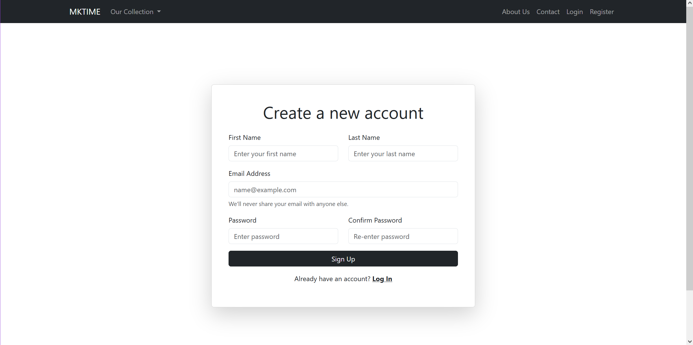

# **Portfolio Brief: MKTIME Dynamic eCommerce Website**

## **Portfolio Overview**

The objective of this project is to develop a dynamic eCommerce website named MKTIME using Bootstrap for front-end design, SQL for database management, and PHP for server-side scripting. MKTIME will allow users to register, login, browse products, add items to their cart, and complete the checkout process.

**Key Features:**

**1. User Registration and Authentication:**

-   Users can create a new account by providing necessary details (e.g., name, email, password).
-   Implement user authentication to allow registered users to securely log in.

**2. Product Catalogue:**

-   Display a range of products on the website categorized by type (e.g., watches).
-   Each product should have a detailed page showing its description, price, and other relevant information.

**3. Shopping Cart:**

-   Allow users to add products to a shopping cart and update quantities or remove items.
-   Display the contents of the cart, including the total price.

**4. Checkout Process:**

-   Enable users to proceed to checkout from the shopping cart.

**5. Database Integration (SQL):**

-   Use SQL to design and manage the database for storing user accounts, product details, cart items, and orders.
-   Implement SQL queries to retrieve and update data as required by the website's functionalities.

**6. Responsive Design with Bootstrap:**

-   Ensure the website is responsive and mobile-friendly using Bootstrap framework for front-end development.
-   Design a visually appealing and user-friendly interface for seamless navigation and interaction.

----------

## **Tech Stack**

### **Frontend**

-   **HTML5/CSS3**
-   **Bootstrap**: For responsive and mobile-friendly design.

### **Backend**

-   **PHP**: For server-side scripting and application logic.

### **Database**

-   **MySQL**: For storing and managing user accounts, products, orders, and cart data.

### **Testing**

-   **Cypress**: For end-to-end testing of the website’s functionalities.

----------

## **Screenshots**

### **Homepage**

### **Product Page**

### **Shopping Cart**

### **Registration Page**

----------

## **Testing**

### **Automated Tests with Cypress**

The project includes automated tests using **Cypress** to verify core functionalities:

1.  **Homepage Test**: Ensures the homepage loads and displays correctly.
2.  **User Authentication Tests**: Tests for successful login, logout, and error handling with invalid credentials.
3.  **Navigation Bar Tests**: Verifies that the navigation bar links and dropdown menus function as expected.
4.  **Product Page Tests**: Confirms that products are displayed correctly with accurate details and the "Add to Cart" button works.
5.  **Shopping Cart Tests**: Ensures cart functionality works
6.  **Checkout Process Test**: Simulates a complete checkout and verifies order placement.